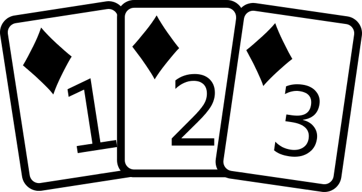
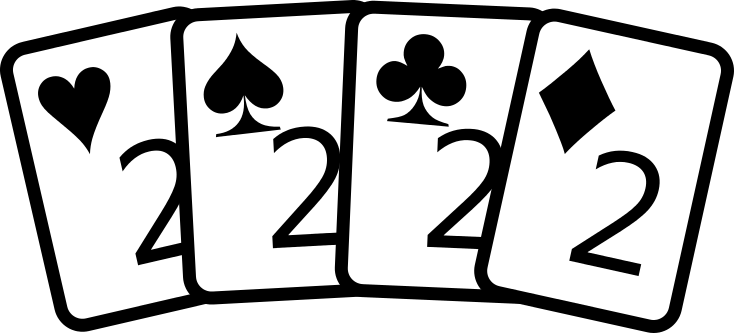
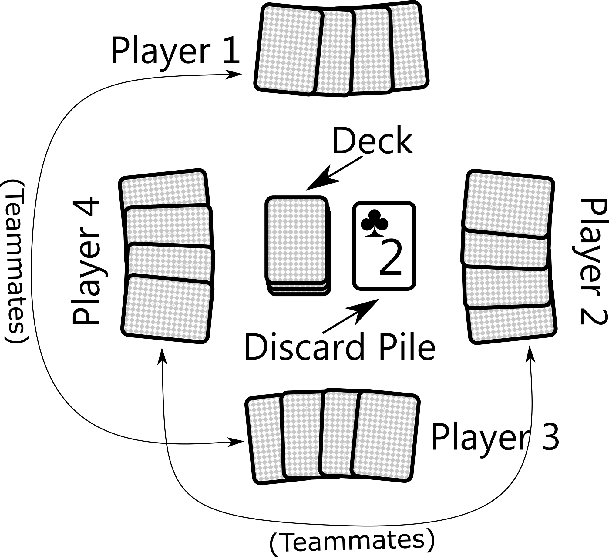
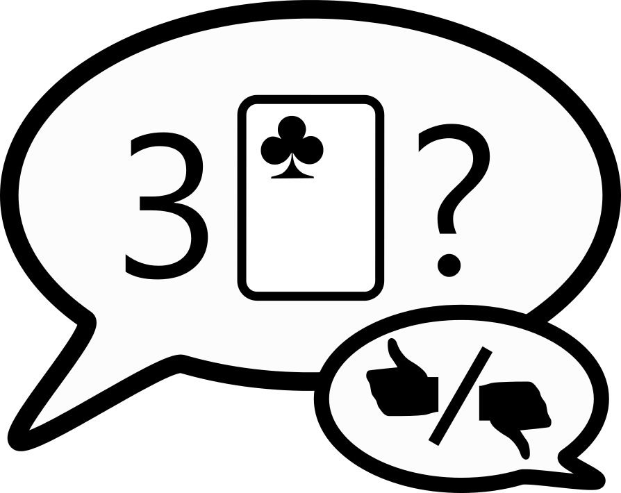

# Pastry Chefs

A card game by David Gundry. Version 0.3.0 2018-04-20

## Teams

Pastry Chefs is a four-player game.  The player sitting opposite you is your teammate.

## Components

* **48 cards**. These consist of the numbers 1-4 in 4 suits, with 3 copies of each card.

## Pastries

In Pastry Chefs, you play chefs trying to bake as many pastries as you can. Do this by making sets of cards. 
Small pastries are made of 3 cards. Big pastries are made of 4 cards. Cards must be either:

* A sequence in a single suit: 1,2,3; or 2,3,4; or 1,2,3,4 

* Different suits with a single number. 

Small pastries (three cards) are worth 1 point. Big pastries (four cards) are worth 2 points. 

## Winning the Game

The first team to get 5 points wins.

## Setup

The cards should be shuffled.

1. Deal each player 4 cards.

No player should be able to make a pastry on their first turn.

2. If any player can make a pastry (see the rules above), shuffle those cards back into the remaining cards.
3. Place the remaining cards face-down to form the deck.
4. Take the top card of the deck and place it face-up to form the discard pile.

## Starting the Game

If this is your first game, play starts with the player who most recently baked something. Otherwise, play starts with the player with the highest score in the previous game. Play proceeds clockwise. 

## On Your Turn

On your turn, you may do one of the following actions (described on the following page):

1. Move cards
2. Draw and Ask
3. Bake a Pastry

At the end of your turn, if you have more than 7 cards, discard down to 7 cards. (Discarded cards go in the discard pile).

If you have fewer than 2 cards in hand, draw cards from the deck until you have at least 2.  When you draw cards, you must follow the **Reveal** rule.

## Reveal

Whenever you draw 1 or more cards from the deck, you must reveal either the number or suit (or both) of 1 of the cards. You must also say how many of the cards you drew share this number or suit. Your decision will affect the next player’s turn through **Blocking**.

This rule does not apply to gaining a card as the result of the **Move Cards** action. 

## Blocking

A core part of the game is moving cards by describing them. However, you cannot repeat the number or suit that the player immediately before you used, _unless they were using the **Draw and Ask** action_.

Blocking only applies to the **Move Cards** action.

## Discard Pile

Using the **Move Cards** action, you can move any cards from the discard pile, so long as you can identify them within the rules. You are not limited to the top card.

## Communication during the Game

Don’t reveal what you know about players’ hands (including your own).

## Actions

### 1. Move Cards

You can ask for cards to be moved between players (including to and from yourself), or between the discard pile and a player. This includes taking cards from an opponent and giving them to your team-mate.

You may move 1 or more cards. Identify them by giving either:

1. the suit they share
2. the number they share
3. both the number and the suit they share

You must always identify the cards to the other players and you must always give the exact number of cards to move. This applies even if the cards start in your own hand.

The player who is holding the cards selects which matching cards to move to the target player. If they cannot move the exact number of cards identified, they do not move any cards and you must discard a card from your hand to the discard pile. (When moving cards out of the discard pile, you select the matching cards to move.)

**Blocking:** You may not identify cards using either the number or the suit that the player before you used, unless they did so using the **Draw and Ask** action. For example, if they identified the "three of clubs", you cannot use either threes or clubs (or both together).

### 2. Draw and Ask

Pick a player. They draw a card from the deck. If you do not pick yourself, the player you pick must now follow the **Reveal** rule.

Then, if you have fewer than 4 cards in your hand, you may choose to draw a second card to yourself. If you cannot draw a second card, or choose not to, you may proceed to the **Ask** section below.

If you have drawn 1 or more cards this turn, you must now follow the **Reveal** rule.

**Ask:** You may ask another player if they have at least a certain number of cards, which are all of either:

1. a certain suit
2. a certain face-number.
3. both of these

For example, you might ask “Do you have three hearts?” They would respond “yes” even if they had four hearts.

### 3. Bake a Pastry

You can place cards in front of you that form a pastry.

## Example Turns
* You ask the next player to move 2 hearts to your team-mate (blocking hearts). The next player has 3 hearts, so they pick 2 of them.
* You get your team-mate to draw a card. Your team-mate reveals that it is a spade (blocking spades). You then ask the next player if they have any 3s. They respond “no”.
* (If you have 2 or fewer cards) You draw 2 cards to yourself. You then reveal that they were both 4 of clubs (blocking 4s and clubs).
* You play 1,2,3,4 of diamonds, scoring 2 points for your team.

## Strategy Tips

1. It is usually better to move cards to your team-mate than to yourself. They can play them sooner.
2. Don’t forget to protect your team-mate’s cards through blocking.
3. If you’ve nearly made a set (but not quite), try moving them to your teammate.